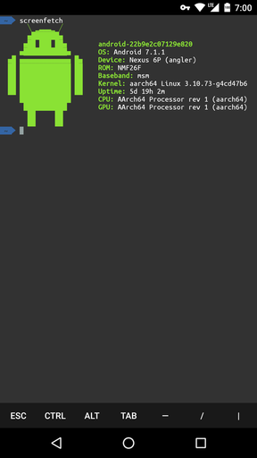

Termux-ohmyzsh implements oh-my-zsh and [zsh-syntax-highlighting](https://github.com/zsh-users/zsh-syntax-highlighting) on your Termux app, as well as some color schemes (most are from [Gogh](https://github.com/Mayccoll/Gogh)), and some Powerline fonts (ported from [powerline/fonts](https://github.com/powerline/fonts)). Default set is agnoster for oh-my-zsh, Tango for color scheme, and Ubuntu font.


**This repo requires Termux official repo. In mainland China, you may need to add Termux app to your proxy list in order to gain access to Termux official repository.**

## Install:
```shell
sh -c "$(curl -fsSL https://raw.githubusercontent.com/MantalStudio1/Termux-style/master/install.sh)"
```

## Change color scheme:
Run `chcolor` to change color scheme, or run:
```shell
~/.termux/colors.sh
```
## Change font:
Run `chfont` to change font, or run:
```shell
~/.termux/fonts.sh
```

## Requirements:
 - curl

## Revert environment
1. Under the home directory, you can find some zshrc backup files named with date, like `.zshrc.bak.2018.1.1-00:00:00`. Rename the backup file back to `.zshrc`. If there doesn't exist any backups, remove the current `.zshrc`.

2. You can also find some termux configuration backup directory, named with date, like `.termux.bak.2018.1.1-00:00:00`. Rename the backup directory back to `.termux`. If there doesn't exist any backups, remove the current `.termux`.

3. Restart termux

## Tips (See Termux Wiki)
Use two-finger pinch to adjust font size. Termux use combination with volume keys to emulate some functions in shell:
* `VolDown+C`: `Ctrl+C`, send SIGINT to interrupt current process
* `VolDown+D`: `Ctrl+D`, EOF logout current session
* `VolDown+E`: `Ctrl+E`, move cursor to end of line in shell
* `VolDown+L`: `Ctrl+L`, clear terminal screen
* `VolDown+Z`: `Ctrl+Z`, send SIGTSTP to suspend current process

You can `VolUp+Q` to bring up an extra key bar, but you can also use combinations below:
* `VolUp+W/A/S/D`: Move cursor up/left/down/right
* `VolUp+E`: ESC
* `VolUp+T`: TAB
* `VolUp+Digits`: F1-F9, F10 is 0
* `VolUp+L`: pipe character "|"
* `VolUp+H`: tilt character "~"
* `VolUp+U`: underscore "_"
* `VolUp+V`: Volume control

For better text input experience, swipe left on the `VolUp+Q` key bar.


## Example
Tango color scheme + agnoster oh-my-zsh theme + Ubuntu font:


